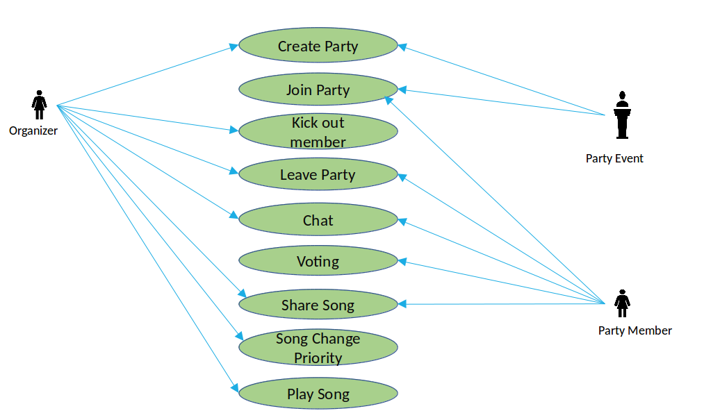
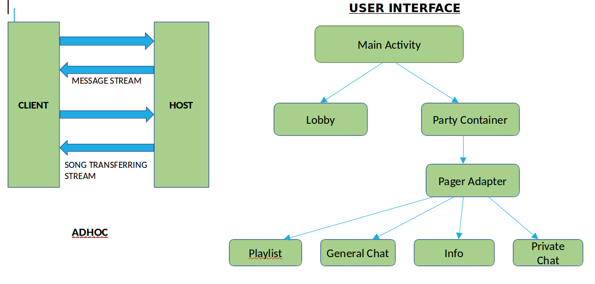
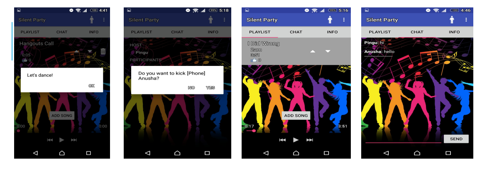

# Silent-Music-Party-App

# 1. Introduction:
Without music, a party can be rather boring. Unfortunately, a lot of times the noise level of music can be a nuisance and kill a party faster than it started. The application, Silent Music Party provides state-of-the-art technology in the palm of the hand. 
Music is still one of the key threads that bind us as humans, and the goal was to create an app that will be intuitive and fun to use. This app  aids in synchronizing music across multiple devices over the cellular network. We took all the elements that make a silent music party interactive and distilled it into simple, easy functions in an app that makes a great time.
Through this design document, we will provide narrative view of silent music party. It includes technical description and demonstration of functionality through the snapshots.

## 1.1 PURPOSE
The silent music player is a concert that attempts to eliminate noise pollution by transmitting the sound to the listeners ears via headphones rather than traditional ambient methods. The elimination of noise pollution is beneficial for nearby campers, nearby residents, and is a good way to keep the music going late into the night when excess noise is traditionally unwelcome. 

# 2. Design Overview
## 2.1 INTRODUCTION

Silent music party provide functionality of Synchronized listing of the music, shared stored playlist, voting for the song (applicable only for dancing people) and transferring of messages. The system revolves around two types of users namely Organizer and Party member where each user is capable of performing limited tasks which are relevant to their roles.
## 2.2 Roles and entities
Below are the tasks lists for each role:

**Entities**
 - user roles (organizer, party people)
 - party event
 
**Role: User**  	 
 - create a party event
 - search for party events       	
 - join a party event
 - leave a party event
 - see other party members    	
 - group chat or individual chat

**Role: organizer**     	
 - Kick out party members 	
 - close the party event
 - Play song
 - Change song priority based on the voting by party members.

**Role: party member**
Having a locally stored and synchronized playlist enables synchronization in listing the current played song
- adding songs to the playlist
- voting songs on the playlist up/down (if I “dance”)
- chat
- leave the party.

## 2.3 Use Case Diagram
The roles of the application are descibed in the next slide using use case diagram.

# 3. Architecture

## 3.1 Description of Technical Architecture:
The framework provides detailed description about the functioning and technical features of the application. It mainly combines multiple wireless hosts forming a temporary network without the assistance of any centralized services. We designed a flexible framework for UI design that allows the app to be more interactive. Our user interface primarily focuses on the requirements of the target user.
 
## 3.2 Interactive UI:
Interactive UI involves main activity which contains two main parts namely lobby and Party container. In lobby, users can view different other parties and in party container, we have a playlist, general chat, info and private chat features.

## 3.3 Ad hoc network:
Mobile ad-hoc networks will use mobile routers to provide Internet connectivity to mobile ad-hoc users. Ad-hoc networks are suited for use in situations where an infrastructure is unavailable or to deploy one is not cost effective. In our application we are creating a ad hoc network via wifi-direct to allow party member for joining the party, share synchronized songs etc.

## 3.4 Socket programming:
We used java sockets to enable communication mechanism between the peers for message transferring and song synchronization feature we applied socket programming.

# 4. Implementation
Implemented the APK on android mobile and extracted the snapshots to describe the functions of the application.

# 5. Conclusion
Worked on developing silent music party application which lead to the achievement of goals defined in the project feature list. This application minimises the noise caused in the party place and  provides us with the environmental benefits. It enables users to make use of the developed application in an intuitive way. The conclusion is that this approach is noiseless and user friendly.

